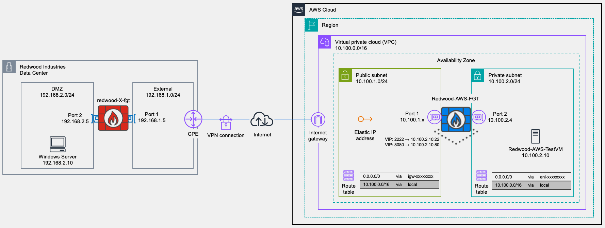
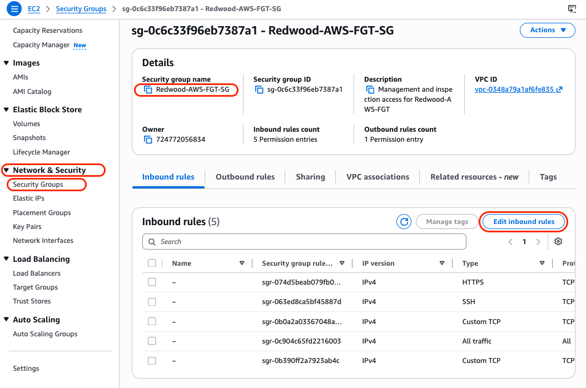
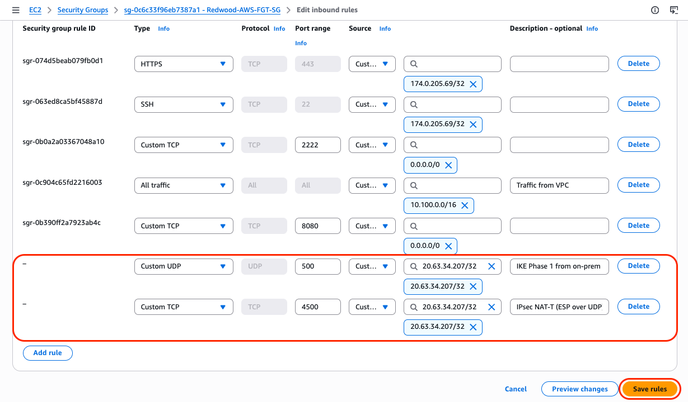
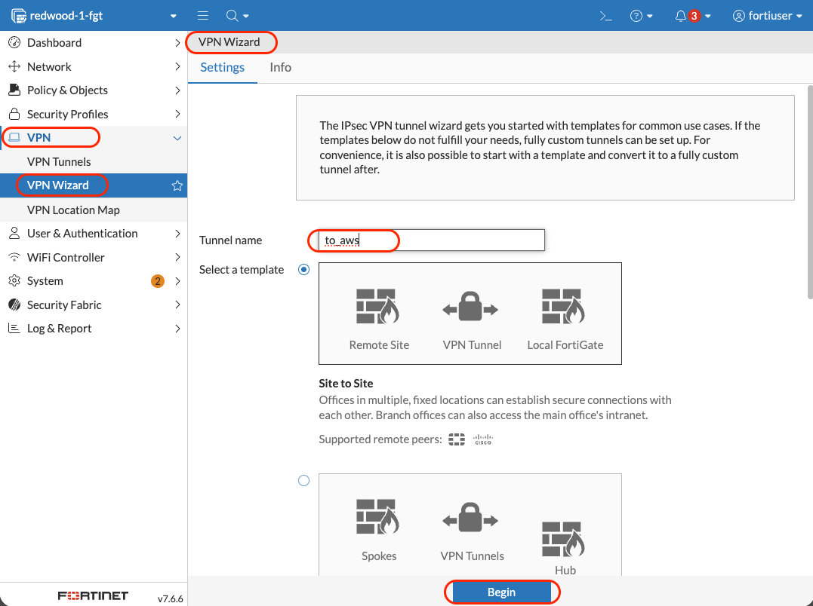
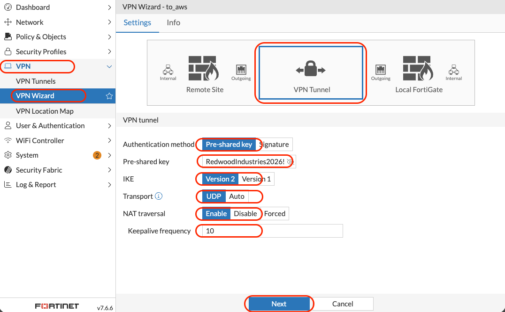

# AWS-101 Lab 4: Site-to-Site VPN Configuration

## Lab Overview

### Objective

Establish an IPsec site-to-site VPN tunnel between the AWS FortiGate (`Redwood-AWS-FGT` from Lab 2) and an on-premises FortiGate, so that the AWS `Private-Subnet` (`10.100.2.0/24`) and the on-prem network (`192.168.0.0/22`) can communicate privately and securely over the Internet — without an AWS Site-to-Site VPN Gateway, Direct Connect, or Transit Gateway.

By the end of this lab, the test workload from Lab 3 (`Redwood-AWS-TestVM` at `10.100.2.10`) will reach an on-prem host directly by its `192.168.x.x` address, and an on-prem host will reach the AWS test VM the same way — all encrypted in transit, all inspected by FortiGate at both ends.

### What You'll Build

- An **inbound rule on the AWS FortiGate security group** allowing IKE (UDP/500) and IPsec NAT-T (UDP/4500) from the on-prem FortiGate's public IP
- An **IPsec VPN tunnel** named `to_aws` on the on-premises FortiGate
- An **IPsec VPN tunnel** named `to_on_prem` on the AWS FortiGate, with matching parameters
- Auto-generated firewall policies and routes on both FortiGates allowing bidirectional traffic across the tunnel
- Validated **bidirectional connectivity** between AWS `Private-Subnet` and on-prem `192.168.0.0/22`

### Architecture After Lab 4



### Business Context

Redwood Industries' AWS landing zone is now ready for production workloads, but most of the company's databases, identity systems, and management tooling still live on-premises. To let cloud workloads talk to those systems privately — and to give the security team a single point of inspection — Redwood needs an encrypted tunnel between the AWS environment and the on-prem datacentre.

A FortiGate-to-FortiGate IPsec VPN is the cheapest way to achieve this: no AWS VPN Gateway hourly charge, no Transit Gateway attachment fee, the same policies and visibility used everywhere else, and operational consistency for the network team. In this lab you build that tunnel, validate it end-to-end, and complete the AWS-101 workshop with a working hybrid topology.

---

## Prerequisites

- Labs 1, 2, and 3 completed (VPC, both subnets, IGW, Public RT, FortiGate VM with FortiFlex licence, Private RT pointing at `port2`, test VM running, inbound VIPs, outbound NAT policy)
- The AWS FortiGate Elastic IP (`Redwood-AWS-FGT-EIP` — recorded in Lab 2 Step 4)
- The on-premises FortiGate's **public IP** and **admin credentials** (provided by your instructor or already known if it is your own lab gateway)
- The on-premises FortiGate's `port2` private IP and the on-prem internal network CIDR (`192.168.0.0/22` for this workshop)
- A pre-shared key (PSK) shared with the instructor — this lab uses `RedwoodIndustries2026!`

> [!IMPORTANT]
> **NAT Traversal (NAT-T) is mandatory on the AWS side.** The AWS FortiGate's `port1` interface holds a private VPC address (`10.100.1.x`). The Elastic IP exists at the Internet Gateway and is applied via 1:1 NAT downstream of FortiGate. Without NAT-T, IKE will detect the NAT mid-path and ESP traffic will be silently dropped. NAT-T encapsulates ESP in UDP/4500, which traverses the IGW correctly.

<details>

<summary> :books: NAT Traversal (NAT-T) and ESP — Deep Dive</summary>

### The Problem: ESP and NAT Don't Mix

IPsec in transport/tunnel mode uses **ESP (Encapsulating Security Payload)** — IP protocol number 50. ESP is a Layer 3 protocol, sitting directly on top of IP, with no port numbers. It looks like this:

```text
[ IP Header | ESP Header | Encrypted Payload | ESP Trailer | ESP Auth ]
```

This creates a fundamental conflict with NAT:

- NAT devices work by rewriting **IP addresses and port numbers** in packet headers
- ESP has **no port numbers** — so a NAT device can't build a translation table entry for it
- Worse, ESP **cryptographically signs the payload** — if a NAT device rewrites the source IP in the outer IP header, the IKE integrity check on the other end detects the modification and **drops the packet**

So a standard NAT device in the path between two IPsec peers will either silently drop ESP packets or corrupt them.

---

### IKE's NAT Detection Mechanism

Before the tunnel comes up, IKE (the key exchange protocol) runs a built-in NAT detection exchange during **Phase 1**. Both peers send hashes of their own IP:port combination. Each side compares what it received against what it computed locally:

```text
Peer A sends:  hash(my_IP, my_port)
Peer B receives it and computes: hash(source_IP_it_sees, source_port_it_sees)

If they don't match → NAT is detected in the path
```

In the AWS lab, the on-prem FortiGate sends IKE from its public IP. The AWS FortiGate receives it at `port1` (`10.100.1.x`) — but the outer IP header shows the on-prem public IP as source. On the AWS side, `port1` holds `10.100.1.x` while the Elastic IP is at the IGW. So when the on-prem peer hashes what it thinks the AWS peer's address is (the EIP) vs. what the IKE packet actually arrives with (`10.100.1.x`), the hashes don't match — **NAT detected**.

---

### The Fix: NAT-T (RFC 3948)

NAT-T solves this by **wrapping ESP inside UDP**:

```text
Without NAT-T:
[ IP Header | ESP Header | Encrypted Payload ]
                ↑ protocol 50, no ports, NAT breaks this

With NAT-T:
[ IP Header | UDP Header (port 4500) | NAT-T marker | ESP Header | Encrypted Payload ]
                         ↑ now has ports, NAT can track this
```

The UDP wrapper gives NAT devices something to work with — source and destination ports — so translation tables can be built and maintained. The ESP payload inside is untouched, so the cryptographic integrity check still passes.

**Port 4500** is the IANA-assigned port for NAT-T. IKE itself moves from UDP/500 to UDP/4500 as well once NAT is detected, so both Phase 1 completion and Phase 2 happen over UDP/4500 when NAT-T is active.

---

### Why This Is Mandatory in the AWS Architecture

```text
On-prem FortiGate          Internet          AWS IGW              AWS FortiGate
(public IP: x.x.x.x)  ──────────────────►  (EIP: y.y.y.y)  ──►  port1: 10.100.1.x
```

The IGW performs 1:1 NAT between the EIP and `port1`'s private IP. From the on-prem peer's perspective, it is talking to `y.y.y.y` (the EIP). But the AWS FortiGate's `port1` only sees `10.100.1.x` — it has no awareness of the EIP. This is a NAT in the path by definition.

Without NAT-T:

- IKE Phase 1 might complete (IKE uses UDP/500, which NAT can handle)
- But Phase 2 would try to switch to ESP (protocol 50)
- The IGW can't translate ESP — it has no port numbers to track
- ESP packets are dropped silently at the IGW
- The tunnel appears to come up (Phase 1 green) but **passes zero traffic**

With NAT-T:

- IKE detects the NAT during Phase 1
- Both sides agree to encapsulate ESP in UDP/4500
- The IGW sees normal UDP traffic, translates it via the EIP, forwards it
- The AWS FortiGate receives UDP/4500, strips the UDP wrapper, processes ESP normally
- Tunnel comes up and passes traffic correctly

---

### The Keepalive Dimension

NAT devices maintain translation table entries based on traffic activity. If a UDP/4500 flow goes idle (no packets for ~30 seconds on many NAT devices), the entry is purged. The next ESP packet arrives at the NAT device with no translation entry and gets dropped — causing the tunnel to appear to drop randomly under low-traffic conditions.

NAT-T solves this with **DPD (Dead Peer Detection) keepalives** — small UDP/4500 packets sent periodically (every 10 seconds in the lab) to keep the NAT translation entry alive, even when no user traffic is flowing.

This is why the lab explicitly sets `Keepalive frequency: 10` seconds. AWS's IGW NAT table timeout is not publicly documented but is known to be short — 10 seconds is conservative and safe.

---

### Quick Reference

| Concept | Detail |
| --- | --- |
| ESP | IP protocol 50 — no ports, encrypts+authenticates payload |
| IKE Phase 1 | UDP/500 — negotiates keys, detects NAT |
| IKE Phase 2 | Negotiates SAs for the actual tunnel |
| NAT-T trigger | IKE NAT detection hash mismatch |
| NAT-T encapsulation | ESP wrapped in UDP/4500 |
| DPD keepalive | Periodic UDP/4500 to prevent NAT table expiry |
| AWS IGW role | 1:1 NAT between EIP and port1 private IP — makes NAT-T mandatory |

</details>

---

## Pre-Lab: Gather VPN Parameters

Write each value down before you start configuring — typos are the most common reason a tunnel fails to come up.

### AWS FortiGate (`Redwood-AWS-FGT`)

| Parameter | Value |
| --- | --- |
| Public IP (Elastic IP) | `<Redwood-AWS-FGT-EIP>` (from Lab 2 Step 4) |
| Local network | `10.100.0.0/16` |
| WAN-side interface | `port1` |
| LAN-side interface | `port2` (`10.100.2.4` static) |

### On-Premises FortiGate

| Parameter | Value |
| --- | --- |
| Public IP | `<on-prem-public-ip>` (provided by instructor) |
| Local network | `192.168.0.0/22` |
| WAN-side interface | `port1` |
| LAN-side interface | `port2` (`192.168.2.4`) |

### IKE / IPsec Parameters (used on both sides)

| Parameter | Value |
| --- | --- |
| Pre-shared Key (PSK) | `RedwoodIndustries2026!` (case-sensitive — copy/paste to avoid typos) |
| IKE Version | `IKEv2` |
| Authentication | `Pre-shared Key` |
| NAT Traversal | **Enabled** |
| Keepalive (DPD) frequency | `10` seconds |
| Phase 1 encryption / hash / DH | `AES-256 / SHA-256 / DH Group 14` (auto-set by the wizard) |

### Configuration Summary

| Parameter | On-Premises FortiGate | AWS FortiGate |
| --- | --- | --- |
| Tunnel name | `to_aws` | `to_on_prem` |
| Remote peer IP | `<Redwood-AWS-FGT-EIP>` | `<on-prem-public-ip>` |
| Remote subnets | `10.100.0.0/16` | `192.168.0.0/22` |
| Local subnets | `192.168.0.0/22` | `10.100.0.0/16` |
| WAN interface | `port1` | `port1` |
| LAN interface | `port2` | `port2` |
| PSK | `RedwoodIndustries2026!` | `RedwoodIndustries2026!` |

---

## Step 1: Allow IPsec Traffic to the AWS FortiGate

In Lab 2 you created `Redwood-AWS-FGT-SG` with rules for `HTTPS` (443), `SSH` (22), inbound VIP ports (2222 and 8080), and all traffic from the VPC CIDR. IKE and ESP-over-NAT-T (UDP 500 and 4500) were not opened — they were not needed until now. The on-premises FortiGate's IKE packets must reach the AWS FortiGate's `port1` ENI for the tunnel to come up, so you'll add those two rules.

1. **Open the AWS FortiGate security group:**
   - In the top search bar, type `EC2` and click **EC2** (the service result)
   - In the left navigation menu under **Network & Security**, click **Security Groups**
   - Select `Redwood-AWS-FGT-SG`

   

2. **Edit inbound rules:**
   - Click **Inbound rules → Edit inbound rules**
   - Click **Add rule** twice — add the two rules below.

     | Type | Protocol | Port range | Source type | Source | Description |
     | --- | --- | --- | --- | --- | --- |
     | Custom UDP | UDP | 500 | Custom | `<on-prem-public-ip>/32` | IKE Phase 1 from on-prem FortiGate |
     | Custom UDP | UDP | 4500 | Custom | `<on-prem-public-ip>/32` | IPsec NAT-T (ESP over UDP) from on-prem FortiGate |

   - Click **Save rules**

   

> [!TIP]
> Pin the source CIDR to the on-prem FortiGate's `/32` rather than `0.0.0.0/0`. IKE/NAT-T endpoints exposed to the open Internet attract probing within minutes; restricting to the known peer is a free hardening measure.

### Validation

- [x] `Redwood-AWS-FGT-SG` shows the two new rules with **Inbound** type
- [x] Source for each rule is the on-prem FortiGate's public IP (`/32`)
- [x] No other AWS-side change is needed — outbound is allowed by default in a security group, and the existing `Redwood-AWS-RT-Private` route table already steers `Private-Subnet` traffic to FortiGate's `port2`

---

## PART A: Configure the On-Premises FortiGate

You will configure the on-prem side first, leave it in a "waiting" state (Phase 1 down), then configure the AWS side. As soon as the AWS-side wizard finishes, the tunnel should come up automatically.

---

## Step 2: Log Into the On-Premises FortiGate

1. **Open the on-prem FortiGate GUI:**
   - In your browser, navigate to `https://<on-prem-public-ip>` (or whatever access path your instructor provided)
   - Accept the self-signed certificate warning

2. **Log in** with the credentials provided by your instructor.

### Validation

- [x] On-prem FortiGate dashboard is visible
- [x] You have noted both public IPs: AWS Elastic IP and on-prem public IP

---

## Step 3: Create the VPN Tunnel `to_aws` Using the VPN Wizard

The FortiGate VPN Wizard generates the tunnel interface, the Phase 1 / Phase 2 settings, both firewall policies, the static route to the remote subnet, and the address objects for local/remote networks — in a single submission.

1. **Start the VPN Wizard:**

   - In the on-prem FortiGate GUI, click **VPN → VPN Wizard**
   - Use the parameters below.

     | Parameter | Value |
     | --- | --- |
     | Tunnel Name | `to_aws` |
     | Select a template | `Site to Site` |

   - Click **Begin**

   

2. **VPN Tunnel:**

   - Use the parameters below.

     | Parameter | Value |
     | --- | --- |
     | Authentication method | `Pre-shared Key` |
     | Pre-shared Key | `RedwoodIndustries2026!` (see note below) |
     | IKE | `Version 2` |
     | Transport | `UDP` |
     | NAT Traversal | `Enable` |
     | Keepalive frequency | 10 |

   > [!IMPORTANT]
   > In production, PSKs should be random (minimum 20 characters, full ASCII entropy), and consider certificate-based authentication as the preferred IKEv2 method per AWS and Fortinet best practices.

   - Click **Next**

   

3. **Remote Site:**

   - Use the parameters below.

     | Parameter | Value |
     | --- | --- |
     | Remote site device type | Fortinet (click on the logo) |
     | Remote site device | `Accessible and static` |
     | IP/FQDN | `<Redwood-AWS-FGT-EIP>` (from Lab 2) |
     | Route this device's internet traffic through the remote site. | `Off` |
     | Remote site subnets that can access VPN | `10.100.0.0/16` |

   - Click **Next**

4. **Local Site:**
   - Use the parameters below.

     | Parameter | Value |
     | --- | --- |
     | Outgoing interface that binds to tunnel | `port1` |
     | Create and add interface to zone | `Off` |
     | Local site | `port2` |
     | Local subnets that can access VPN | `192.168.0.0/22` |
     | Allow remote site's internet traffic through this device | `Off` |

   - Click **Next**

5. **Review**

   - Review the what the wizard will build
   - Click **Submit**

6. **Verify what the wizard built:**
   - Navigate to **VPN → IPsec Tunnels** — confirm `to_aws` is listed with status **Inactive** (Phase 1 cannot complete until the AWS side is configured)
   - Navigate to **Network → Static Routes** — confirm a route for `10.100.0.0/16` via the `to_aws` interface
   - Navigate to **Policy & Objects → Firewall Policy** — confirm two new policies: one for `port2 → to_aws` (outbound to AWS) and one for `to_aws → port2` (inbound from AWS)

### Validation

- [x] `to_aws` appears under **VPN → IPsec Tunnels**
- [x] Static route to `10.100.0.0/16` via `to_aws` interface exists
- [x] Two firewall policies exist for traffic between `port2` and the `to_aws` tunnel interface
- [x] Tunnel status is **Inactive** (expected — the AWS side is not yet configured)

---

## PART B: Configure the AWS FortiGate

Now mirror the configuration on the AWS FortiGate. Same wizard, swapped local and remote values.

---

## Step 4: Create the VPN Tunnel `to_on_prem` on the AWS FortiGate

1. **Log into the AWS FortiGate** at `https://<Redwood-AWS-FGT-EIP>` (or open an existing browser tab from Lab 3).

2. **Start the VPN Wizard:**
   - Click **VPN → VPN Wizard**
   - Use the parameters below.

     | Parameter | Value |
     | --- | --- |
     | Tunnel Name | `to_on_prem` |
     | Select a template| `Site to Site` |

   - Click **Begin**

3. **VPN Tunnel:**

   - Use the parameters below.

     | Parameter | Value |
     | --- | --- |
     | Authentication method | `Pre-shared Key` |
     | Pre-shared Key | `RedwoodIndustries2026!` (see note below) |
     | IKE | `Version 2` |
     | Transport | `UDP` |
     | NAT Traversal | `Enable` |
     | Keepalive frequency | 10 |

> [!IMPORTANT]
> In production, PSKs should be random (minimum 20 characters, full ASCII entropy), and consider certificate-based authentication as the preferred IKEv2 method per AWS and Fortinet best practices.

   - Click **Next**

4. **Remote Site:**

   - Use the parameters below.

     | Parameter | Value |
     | --- | --- |
     | Remote site device type | Fortinet (click on the logo) |
     | Remote site device | `Accessible and static` |
     | IP/FQDN | `<on-prem-public-ip>` (provided by the instructor) |
     | Route this device's internet traffic through the remote site. | `Off` |
     | Remote site subnets that can access VPN | `192.168.0.0/22` |

   - Click **Next**

5. **Local Site:**
   - Use the parameters below.

     | Parameter | Value |
     | --- | --- |
     | Outgoing interface that binds to tunnel | `port1` |
     | Create and add interface to zone | `Off` |
     | Local site | `port2` |
     | Local subnets that can access VPN | `10.100.0.0/16` |
     | Allow remote site's internet traffic through this device | `Off` |

   - Click **Next**

6. **Review**

   - Review the what the wizard will build
   - Click **Submit**

7. **Verify what the wizard built (mirror of the on-prem side):**
   - **VPN → IPsec Tunnels** — `to_on_prem` should appear; within ~30 seconds Phase 1 and Phase 2 should both come up
   - **Network → Static Routes** — route for `192.168.0.0/22` via the `to_on_prem` interface
   - **Policy & Objects → Firewall Policy** — two new policies for `port2 ↔ to_on_prem`

### Validation

- [x] `to_on_prem` appears under **VPN → IPsec Tunnels** with status **Up** (green)
- [x] Static route to `192.168.0.0/22` via `to_on_prem` interface exists
- [x] Two firewall policies exist for `port2 ↔ to_on_prem`

---

## PART C: Verify the Tunnel and Test Connectivity

Configuration is now symmetric on both sides. The IKE Phase 1 negotiation should already have completed and Phase 2 SAs should be installed. This part proves it.

---

## Step 5: Verify Tunnel Status on Both FortiGates

1. **AWS FortiGate — confirm `to_on_prem`:**
   - In the AWS FortiGate GUI, navigate to **Dashboard → Network Monitor → VPN** widget
   - Confirm the tunnel `to_on_prem` shows:

     | Indicator | Expected |
     | --- | --- |
     | Status | **Up** (green) |
     | Phase 1 | Up |
     | Phase 2 | Up |
     | Remote Gateway | `<on-prem-public-ip>` |
     | Tunnel uptime | non-zero minutes ago |

2. **On-prem FortiGate — confirm `to_aws`:**
   - In the on-prem FortiGate GUI, navigate to **Dashboard → Network → IPsec** widget
   - Confirm `to_aws` shows the same indicators (mirror values)

3. **CLI sanity check (optional) on AWS side :**

   ```text
   diagnose vpn ike gateway list name to_on_prem
   diagnose vpn tunnel list name to_on_prem
   ```

   Expected: `status: established...`, both `phase1` and `phase2` SAs present, encryption `aes-256` / hash `sha256` / DH group 14.

### Validation

- [x] AWS FortiGate `to_on_prem` is **Up** with Phase 1 and Phase 2 both active
- [x] On-prem FortiGate `to_aws` is **Up** with Phase 1 and Phase 2 both active
- [x] No errors in **Log & Report → System Events → VPN Events** on either side

> [!TIP]
> If either side stays **Down** after 60–90 seconds: re-check the PSK (case-sensitive, no leading/trailing whitespace), confirm the AWS security group rule sources match the on-prem public IP, and verify NAT-T is enabled on the AWS side. Most failures at this stage are PSK typos or a missed `/32` on the SG rule.

---

## Step 6: Test Cross-Site Connectivity

Generate real traffic in both directions and confirm it flows through the tunnel.

#### 6.1 Test On-Premises to Redwood-AWS

We'll test connectivity from the on-premises Windows VM to the Redwood-AWS.

1. **Connect to On-Prem VM:**
   - RDP to on-prem Windows VM using the FortiGate public IP address on port 9833.
   - Use the authentication information provided by the instructor

2. **Open PowerShell:**
   - Once connected, click Start Menu
   - Type **PowerShell**
   - Click **Windows PowerShell**

3. **Test Connectivity to Redwood-AWS:**

   ```powershell
   Test-NetConnection -ComputerName 10.100.2.10 -Port 22
   ```

   **Target:** 10.100.2.10 is Redwood-AWS-TestVM in AWS

   **Expected Result:**

   ```powershell
   ComputerName     : 10.100.2.10
   RemoteAddress    : 10.100.2.10
   RemotePort       : 22
   InterfaceAlias   : Ethernet
   SourceAddress    : 192.168.2.10
   TcpTestSucceeded : True
   ```

### Validation

- [x] Test-NetConnection succeeds (TcpTestSucceeded: True)
- [x] Traffic traversing VPN tunnel

#### 6.2 Test Redwood-AWS-TestVM to On-Premises

Now test the reverse direction.

1. **Connect to AWS Redwood-AWS-TestVM:**

   - SSH into the `Redwood-AWS-TestVM`

2. **Test Connectivity to On-Prem:**

   ```bash
   nc -zv 192.168.2.10 3389
   ```

   **Target:** 192.168.2.10 is vm-on-prem-windows

   **Expected Result:**

   ```bash
   Connection to 192.168.2.10 3389 port [tcp/ms-wbt-server] succeeded!
   ```

### Validation

- [x] `nc` to `192.168.2.10` from the AWS test VM succeeds
- [x] `Test-NetConnection` to `10.100.2.10` from an on-prem host succeeds
- [x] TCP reachability tests succeed in both directions
- [x] Forward Traffic logs on both FortiGates show the tunnel interface as the egress for cross-site traffic

### Troubleshooting Failed Connectivity

**If Connectivity Fails:**

**Check 1: VPN Tunnel Status:**

- Is tunnel "up" on both sides? (Step 6)
- If down, fix tunnel before testing traffic

**Check 2: Firewall Policies (On-Prem FortiGate):**

- Navigate to **Policy & Objects → Firewall Policy**
- Look for auto-created VPN policies
- Verify policies exist:
  - port2 → to_aws (outbound)
  - to_aws → port2 (inbound)
- Source: 192.168.0.0/22, Destination: 10.100.0.0/16
- Action: ACCEPT, Status: Enabled

**Check 3: Firewall Policies (Redwood-AWS-FGT):**

- Navigate to **Policy & Objects → Firewall Policy**
- Verify policies exist:
  - port2 → to_on_prem (outbound)
  - to_on_prem → port2 (inbound)
- Source: 10.100.0.0/16, Destination: 192.168.0.0/22
- Action: ACCEPT, Status: Enabled

**Check 4: Routing:**

- **On-Prem FortiGate**: Navigate to **Dashboard → Routing**
- Verify route to 10.100.0.0/16 via to_aws interface
- **Redwood-AWS-FGT** FortiGate: Navigate to **Dashboard → Routing**
- Verify route to 192.168.0.0/22 via to_on_prem interface

**Check 5: Use FortiGate Packet Capture:**

```bash
# On Redwood-AWS-FGT FortiGate CLI:
diagnose sniffer packet any "host 10.100.2.10 and host 192.168.2.10" 4 20
# Generate traffic from VM
# Watch for packets entering port2, encrypting, exiting via VPN
```

---

## Lab 4 Complete

Redwood Industries now has a working hybrid network — encrypted, inspected, and operationally consistent with the on-prem environment.

### Architecture Review

```text
End-to-end traffic flow (AWS → on-prem):

  Redwood-AWS-TestVM (10.100.2.10)
         │
         ▼  AWS RT-Private: 0.0.0.0/0 → port2 ENI
  Redwood-AWS-FGT  port2 (10.100.2.4)
         │
         ▼  Routing: 192.168.0.0/22 → to_on_prem (tunnel interface)
  Redwood-AWS-FGT  IPsec engine: encrypt with PSK, IKEv2, AES-256
         │
         ▼  Outgoing on port1 (10.100.1.x)
  Redwood-AWS-IGW  (1:1 NAT to EIP)
         │
         ▼  ESP over UDP/4500 (NAT-T)
  Internet
         │
         ▼
  On-prem edge → On-prem FortiGate port1 (<on-prem-public-ip>)
         │
         ▼  IPsec engine: decrypt, forward
  On-prem FortiGate port2 (192.168.2.10)
         │
         ▼  Routing: 192.168.0.0/22 → local
  On-prem host (192.168.x.x)
```

### Key Takeaways

1. **The VPN wizard creates everything you need on FortiGate.** Tunnel interface, Phase 1, Phase 2, both directional firewall policies, and the static route to the remote subnet — all in one submission. In production, review the auto-created policies and tighten the source/destination if you don't want any-to-any across the tunnel.

2. **AWS routing did not change.** Lab 2's `Redwood-AWS-RT-Private` (default route → `port2` ENI) handles AWS-to-on-prem traffic exactly the same way it handles AWS-to-Internet traffic — both leave the test VM toward `port2`, FortiGate decides where to send them next based on its **own** routing table (which now has a more-specific route for `192.168.0.0/22` via the tunnel). No AWS route table edits, no Transit Gateway, no AWS Site-to-Site VPN Gateway.

3. **The Elastic IP earns its keep again.** It is the stable IKE peer address that the on-prem FortiGate must know. If the EIP changed (for example, because someone disassociated and released it), the on-prem side would point at a stale address and the tunnel would never re-establish. Treat `Redwood-AWS-FGT-EIP` as a long-lived resource for as long as the VPN exists.

4. **Hybrid security is centralized at FortiGate.** Every cross-site flow is logged on both ends, NAT-free across the tunnel (workloads see each other's real IPs), and subject to whatever policies and security profiles you turn on at the FortiGates. There is no shared-key tunnel terminating in a black-box AWS service — Redwood's security team can troubleshoot, audit, and inspect every byte.

### Quick Reference

**FortiGate VPN objects created (mirror on each side):**

| Object | On-prem FortiGate | AWS FortiGate |
| --- | --- | --- |
| Tunnel interface | `to_aws` | `to_on_prem` |
| Static route | `10.100.0.0/16 → to_aws` | `192.168.0.0/22 → to_on_prem` |
| Outbound policy | `port2 → to_aws` | `port2 → to_on_prem` |
| Inbound policy | `to_aws → port2` | `to_on_prem → port2` |
| Address (local) | `192.168.0.0/22` | `10.100.0.0/16` |
| Address (remote) | `10.100.0.0/16` | `192.168.0.0/22` |

**Useful test commands:**

| From | Command |
| --- | --- |
| AWS test VM | `nc -zv 192.168.2.10 22` |
| On-prem host | `nc -zv 10.100.2.10 22` |
| AWS or on-prem FortiGate CLI | `diagnose vpn ike gateway list name <tunnel>` |
| AWS or on-prem FortiGate CLI | `diagnose vpn tunnel list name <tunnel>` |

---

## Configuration Checklist

Before declaring the workshop complete, verify:

- [ ] AWS security group `Redwood-AWS-FGT-SG` allows inbound UDP/500 and UDP/4500 from the on-prem FortiGate's public IP
- [ ] On-prem FortiGate has tunnel `to_aws` with status **Up**, Phase 1 and Phase 2 both active
- [ ] AWS FortiGate has tunnel `to_on_prem` with status **Up**, Phase 1 and Phase 2 both active
- [ ] Both sides have NAT-T enabled and the AWS side was configured with "This site is behind NAT"
- [ ] Static routes auto-created on both FortiGates point at the correct tunnel interface
- [ ] Two firewall policies exist on each side (one outbound, one inbound) covering the cross-site CIDRs
- [ ] `nc -zv` succeed in both directions between AWS `Private-Subnet` and on-prem `192.168.0.0/22`
- [ ] Forward Traffic logs on both FortiGates show the tunnel interface for cross-site traffic

---

## Workshop Complete

You've now built the full Redwood Industries AWS-101 reference architecture:

| Lab | Outcome |
| --- | --- |
| **Lab 1** | AWS networking foundation — VPC, two subnets, IGW, Public RT |
| **Lab 2** | FortiGate-VM deployment, FortiFlex licence activation, Private RT routing through `port2` |
| **Lab 3** | Test workload + inbound VIPs + outbound NAT policy + Forward Traffic / FortiView verification |
| **Lab 4** | Site-to-site IPsec VPN to on-premises, hybrid connectivity validated |

### What You Can Now Do

- Deploy a FortiGate-VM on AWS with confidence — Marketplace subscription, ENI choreography, source/destination check, FortiFlex licensing, Elastic IP binding
- Configure VPC route tables that route through a security appliance without falling into the local-route trap
- Build inbound VIPs and outbound source-NAT policies and validate them end-to-end
- Establish a FortiGate-to-FortiGate IPsec VPN over AWS with the right NAT-T configuration the first time

### Customer Conversations You Are Now Equipped For

- *"We're moving to AWS — how do we keep using FortiGate?"* → You can sketch the architecture and walk through the deployment.
- *"AWS Network Firewall is too expensive at scale."* → You can articulate the FortiGate alternative with concrete pricing and feature differences.
- *"We need our cloud workloads to talk to on-prem."* → You can demonstrate the FortiGate IPsec tunnel option without an AWS VPN Gateway.
- *"How do we inspect east-west traffic?"* → You can explain the AWS local-route limitation, the per-workload-subnet pattern, and where Gateway Load Balancer (covered in AWS-102) and the Inspection VPC pattern (covered in AWS-103) come in.

### Recommended Next Steps

- **AWS-102: HA** — high availability with two FortiGates, AWS Network Load Balancer, multi-AZ designs
- **AWS-103: Hub-and-Spoke with Transit Gateway** — Inspection VPC pattern, GWLB + FortiGate fleet, centralized egress and east-west inspection
- **AWS-201: Advanced Security & Automation** — Terraform / Ansible / CloudFormation for FortiGate, FortiManager-managed AWS deployments, FortiAnalyzer / SIEM integration

### Clean-Up

When you're done, the tag-based AWS Resource Group makes clean-up trivial:

1. **AWS Resource groups → Resources → Saved Resource Groups →`Redwood-AWS-RG`** — confirm every resource you created shows up here (filtered by `Project=Redwood-AWS-101`)
2. Terminate the FortiGate and Test VM EC2 instances
3. Release the Elastic IP (`Redwood-AWS-FGT-EIP`)
4. Delete `Redwood-AWS-FGT-port2` ENI, the security groups, the route tables, the IGW (after detaching), the subnets, and the VPC
5. Delete the Resource Group itself

**Optionally:**

6. On the on-prem FortiGate, remove the `to_aws` tunnel and its auto-created policies/routes

---

## Troubleshooting Guide

### Tunnel Stays Down (Phase 1 Never Establishes)

| Symptom | Likely cause | Fix |
| --- | --- | --- |
| `IKE_SA_INIT` packets not seen on AWS side | Security group missing UDP/500 rule, or source IP mismatch | Verify Step 1 — UDP/500 from on-prem `/32` |
| Phase 1 starts but never completes | PSK mismatch | Re-enter PSK on both sides — case-sensitive, no spaces |
| `no proposal chosen` in **Log & Report → System Events → VPN Events** | IKE / Phase 2 proposals don't intersect | Verify both sides use IKEv2 + AES-256 + SHA-256 + DH 14; the wizard's defaults match on both sides |
| Phase 1 up, Phase 2 fails with `INVALID_ID_INFORMATION` | Local/remote subnets don't mirror | On AWS, local must be `10.100.0.0/16` and remote `192.168.0.0/22`. On-prem is the opposite |

### Tunnel Up But No Traffic

| Symptom | Likely cause | Fix |
| --- | --- | --- |
| TCP connectivity fails one direction, succeeds the other | Auto-created firewall policy missing or disabled | Verify both `port2 → tunnel` and `tunnel → port2` policies exist and are **Enabled** on the failing side |
| TCP connectivity fails | A security profile or shaper is blocking | Check **Log & Report → Forward Traffic** for `deny` entries; the workshop policies don't enable security profiles, so this should be rare |
| Test VM reaches other AWS resources but not on-prem | FortiGate's own routing table missing the remote route | Check **Network → Static Routes** on the AWS FortiGate — `192.168.0.0/22 → to_on_prem` should exist (auto-created by wizard) |
| On-prem can ping FortiGate `port2` IP (`10.100.2.4`) but not the test VM | AWS test VM SG doesn't allow ICMP from `192.168.0.0/22` | Add an inbound rule on `Redwood-AWS-TestVM-SG` for ICMP from `192.168.0.0/22` (or All ICMP - IPv4 from Anywhere if the workshop SG was already loosened) |

### Tunnel Flapping (Up → Down → Up)

| Symptom | Likely cause | Fix |
| --- | --- | --- |
| Tunnel resets every 8 hours | IKEv2 rekey at lifetime expiry combined with a one-sided proposal mismatch | Confirm Phase 1 and Phase 2 lifetimes match on both sides (default 28800 / 1800) |
| Tunnel resets randomly under load | NAT-T keepalive misconfiguration or AWS NAT timeout | Set DPD interval to 10s on both sides; verify NAT-T is enabled on both sides |
| Tunnel up briefly after wizard completes, then drops | The wizard's auto-created firewall policy may be in the wrong order behind a deny-all | **Policy & Objects → Firewall Policy** — drag the VPN policies above any catch-all deny |

---

## CLI Quick Reference

```text
# Show all IPsec gateways and their state
diagnose vpn ike gateway list

# Show a specific gateway in detail
diagnose vpn ike gateway list name to_on_prem

# Show IPsec SA (Phase 2) status
diagnose vpn tunnel list name to_on_prem

# Bring a tunnel up manually (or down)
diagnose vpn tunnel up to_on_prem
diagnose vpn tunnel down to_on_prem

# Reset (rekey) a tunnel
diagnose vpn tunnel reset to_on_prem

# Live IKE debug — capture a Phase 1 negotiation
diagnose debug application ike -1
diagnose debug enable
# (now bring tunnel up or trigger traffic)
diagnose debug disable
diagnose debug reset

# Confirm the routing table includes the remote subnet via the tunnel
get router info routing-table all | grep 192.168

# Packet capture for cross-site traffic on the AWS side
diagnose sniffer packet any "host 10.100.2.10 and host 192.168.2.10" 4 50
```

---

*Lab Guide Version 1.0 — May 2026*
*Questions? Ask your instructor or refer to the troubleshooting section.*
*End of AWS-101 — congratulations.*
